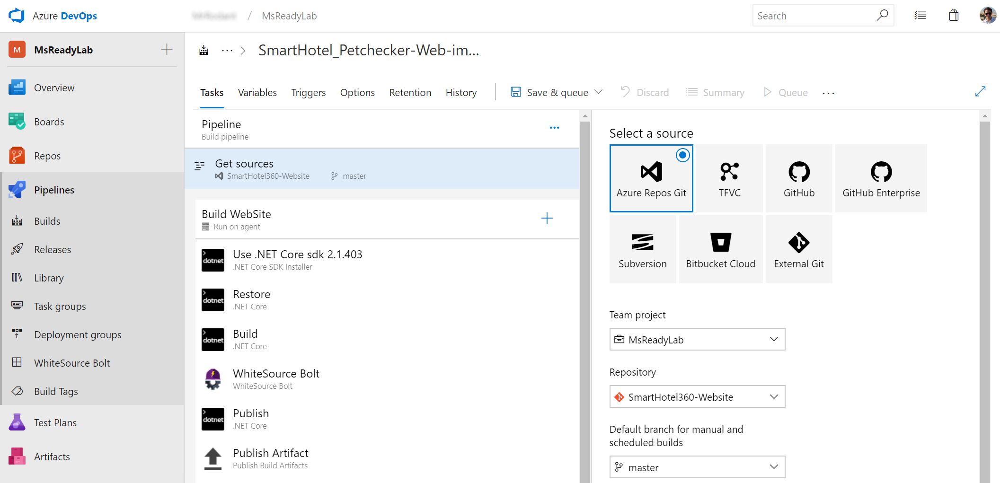
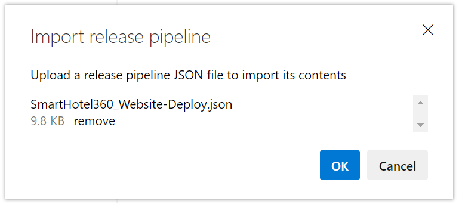
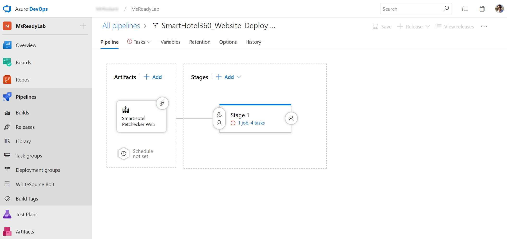
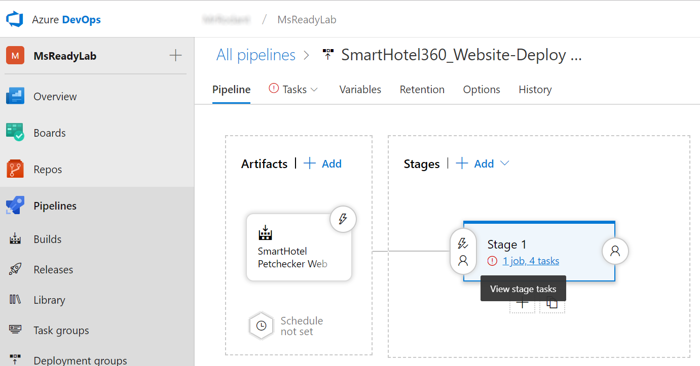
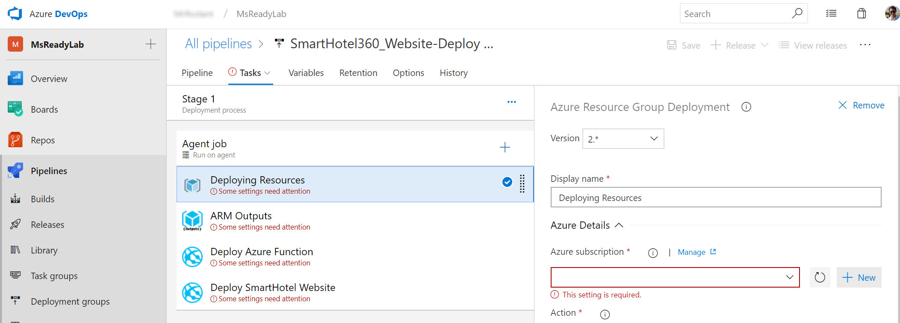
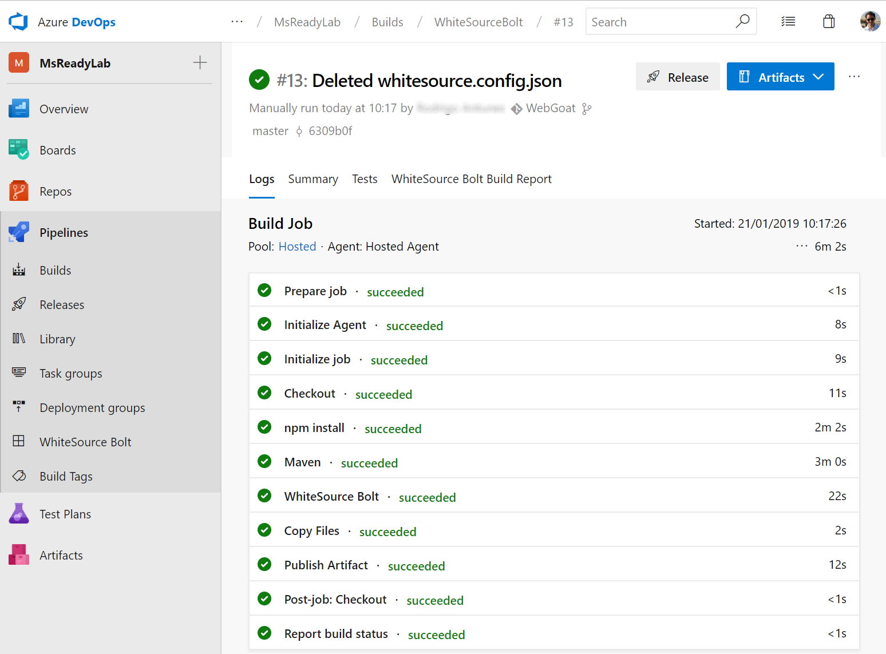
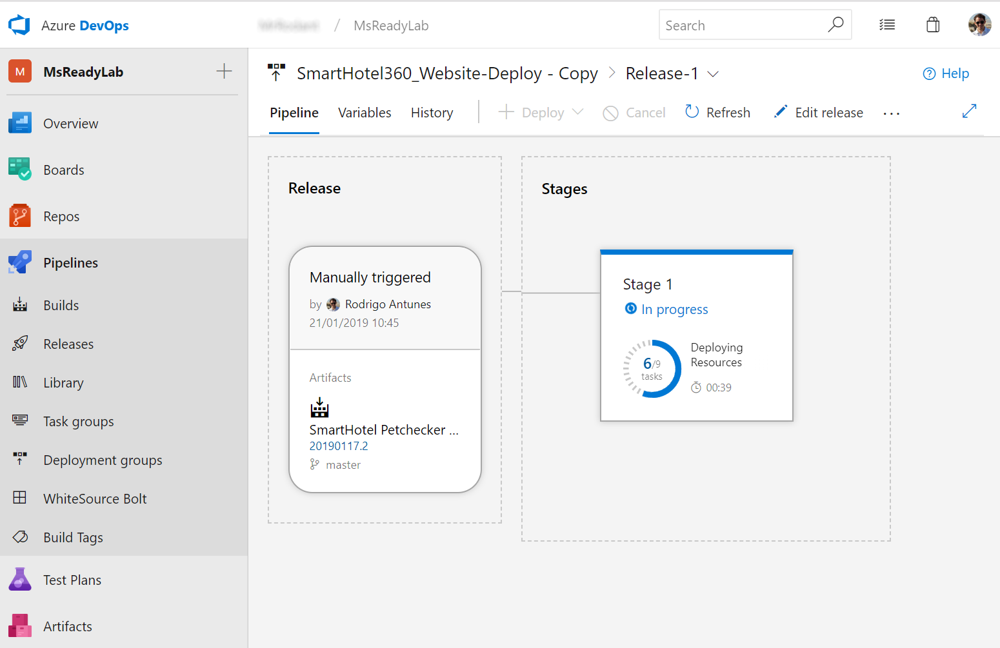

# Microsoft Ready, Feb 2019
## AI-APP-ST300: Hands on Dev*Ops (Dev-Sec-Ops-Biz) 

**Welcome to Technical Lab for the AI-APP-ST300: Hands on Dev*Ops session!**

DevOps has been propagating throughout the world as the place to be in order to be Agile and successful. 
As maturity sets in, new challenges start to come up, namely the security role and the integration with the business teams. 
As such, buzz words like _DevSecOps_ and even _DevSecOpsBiz_ are becoming more popular in discussions. 

This lab session builds on top of _AI-APP-ST201: The new trends of Dev*Ops (DEV-SEC-OPS-BIZ)_, allowing you to experience first hand the construction of a real world scenario.

# Lab: Azure DevOps CI/CD

This lab will guide you through building Continuous Integration (CI) and Continuous Deployment (CD) pipelines with Azure DevOps. The build pipeline will make use of a Java application, built with Maven, but also a .NET Core and Azure Functions App.
For the release pipeline we'll be leveraging ARM templates and Azure App Services to host our application.

## Create Build Pipeline

* Wait a few seconds for the import process to finish and navigate to *Pipelines*, *Builds*:

    

    ### WhiteSource Bolt Build
    1. Under *New*, select *Import a pipeline* to import a precooked pipeline to build the recently imported repo:

        

    2. Drag and drop the `SmartHotel_Petchecker-Web.json` file, or Browse for the same file. Then, press *Import* to start the import process:

        
    
    3. Select the `Hosted VS2017` Agent pool:

        

    4. Now select the Source Repo to the recently imported repository:

        

    5. To finish, enable the *Continuous integration* trigger, saving the build after it:

        

    ### OWASP Build
    
    Now we'll be using an alternative way to setup our CI build, leveraging a YAML file.

    6. Navigate to the `owasp-zap-vsts` repo, and drag and drop the `azure-pipelines.yml` file, located on the Lab contents you've downloaded, under *~/files/OWASP*

## Create Release Pipeline

* Under *Pipelines*, navigate to *Releases* and press `New pipeline`

     

    1. We first need to create a dummy, empty, Release pipeline in order for the *Import* to become available. 
    Let's do this by pressing `New pipeline`, `Empty job` and `Save`:

    

    2. Navigate back to `All pipelines` and `Import a release pipeline`:

    

    

    3. Drag and drop, or navigate, to select the `SmartHotel360_Website-Deploy.json` file:

    

    4. Press *OK* to start the import process. You should now have a release pipeline like this:

    

    5. Navigate to the Stage tasks:

    

    6. Select the first task and, under *Azure Subscription*, press `New`:

    

    7. This opens a pop up where we'll have to fill in the details of our *Azure Subscription*, where we'll be deploying out solution:

    > Step in each one of the options with error, selecting and authorizing an Azure Subscription to use in the lab. 

    8. To finish, enable the Continuous Deployment trigger

    
    

#### Run a test build

1. In Azure DevOps, click on Builds, select each build and click the "Queue" button on the right upper corner.

    

2. Monitor the builds and wait for the build to complete

    

# ADD INFO TO OPEN WEBSITE AND SEE IT WORKED

3. The release will automatically start when the build is complete (be patient, this can take some time). Review the results as it is complete. 

    

4. Now kick-off the full CI/CD pipeline by making an edit to the  code in the Azure DevOps code repo.
Navigate back to *Repos*, *SmartHotel360-Website* repo, select `appsettings.Development.json` and press *Edit*

    

5. Change the *Name* property value to something you want, and *Commit* the change after it

    

## Next step:  
[Include Security into the pipeline](README-3-Security.md)