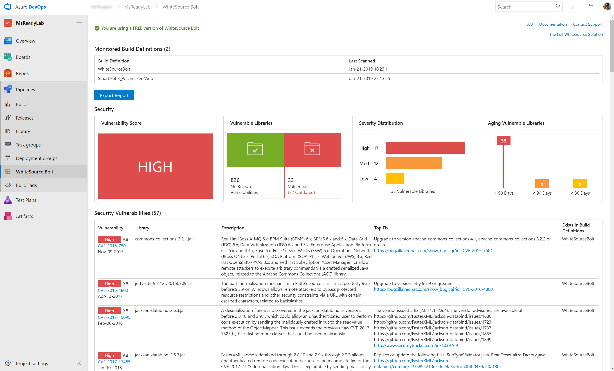
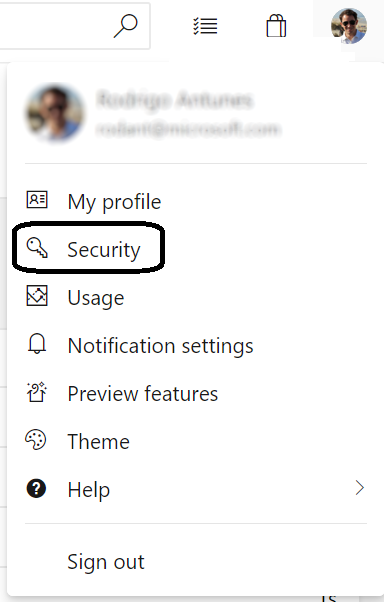
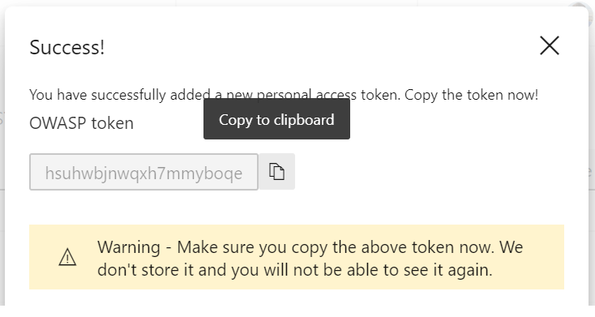
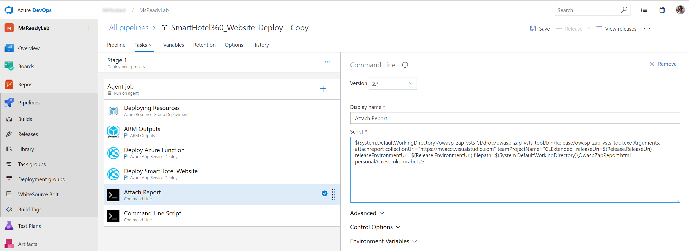
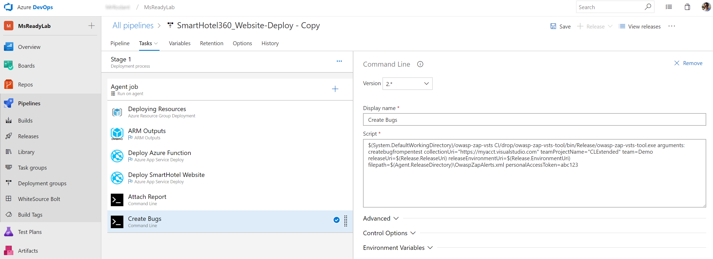

# Microsoft Ready, Feb 2019
## AI-APP-ST300: Hands on Dev*Ops (Dev-Sec-Ops-Biz) 

**Welcome to Technical Lab for the AI-APP-ST300: Hands on Dev*Ops session!**

DevOps has been propagating throughout the world as the place to be in order to be Agile and successful. 
As maturity sets in, new challenges start to come up, namely the security role and the integration with the business teams. 
As such, buzz words like _DevSecOps_ and even _DevSecOpsBiz_ are becoming more popular in discussions. 

This lab session builds on top of _AI-APP-ST201: The new trends of Dev*Ops (DEV-SEC-OPS-BIZ)_, allowing you to experience first hand the construction of a real world scenario.

# Lab: Security

This lab will guide you through adding some Security validations into our pipelines, detecting and fixing security vulnerabilities, but also problematic open source licenses.

## Review WhiteSource Bolt task configurations on Build
> TALK A LITTLE ABOUT EACH TASK AND IS THEIR PURPOSE 

1. In Azure DevOps, click on "Pipelines" on the left menu and then click "Builds"

2. Select each build pipeline, click the "Edit" button, and select the `WhiteSource Bolt` task

    

3. Now navigate to *Pipelines*, *WhiteSource Bolt* on the left and explore the generated reports

    

## Add OWASP ZAP penetration testing tool to the Release pipeline

1. Setup a Docker host
> Steps to run the commands in Cloud Shell
> create MD for this
https://docs.microsoft.com/en-us/azure/virtual-machines/linux/dockerextension

2. Start by obtaining a personal access token (PAT) for later use.
> Save that PAT token, it can't be retrieved later!

Now let's add some `Command` tasks to our release pipeline, one for attaching the generated analysis report and another to be able to create bugs if necessary:

2. Paste this command on the *Script* text box, changing the values in bold*, as seen in the image.
`$(System.DefaultWorkingDirectory)/owasp-zap-vsts CI/drop/owasp-zap-vsts-tool/bin/Release/owasp-zap-vsts-tool.exe Arguments: attachreport collectionUri="https://myacct.visualstudio.com" teamProjectName="MsReadyLab" releaseUri=$(Release.ReleaseUri) releaseEnvironmentUri=$(Release.EnvironmentUri) filepath=$(System.DefaultWorkingDirectory)\OwaspZapReport.html personalAccessToken=abc123`

3. Now paste this for the *Create bugs* task.
`$(System.DefaultWorkingDirectory)/owasp-zap-vsts CI/drop/owasp-zap-vsts-tool/bin/Release/owasp-zap-vsts-tool.exe arguments: createbugfrompentest collectionUri="https://myacct.visualstudio.com" teamProjectName="CLExtended" team=Demo releaseUri=$(Release.ReleaseUri) releaseEnvironmentUri=$(Release.EnvironmentUri) filepath=$(Agent.ReleaseDirectory)\OwaspZapAlerts.xml personalAccessToken=abc123`

## Next step:  
[Gather Business information](README-4-Business.md)